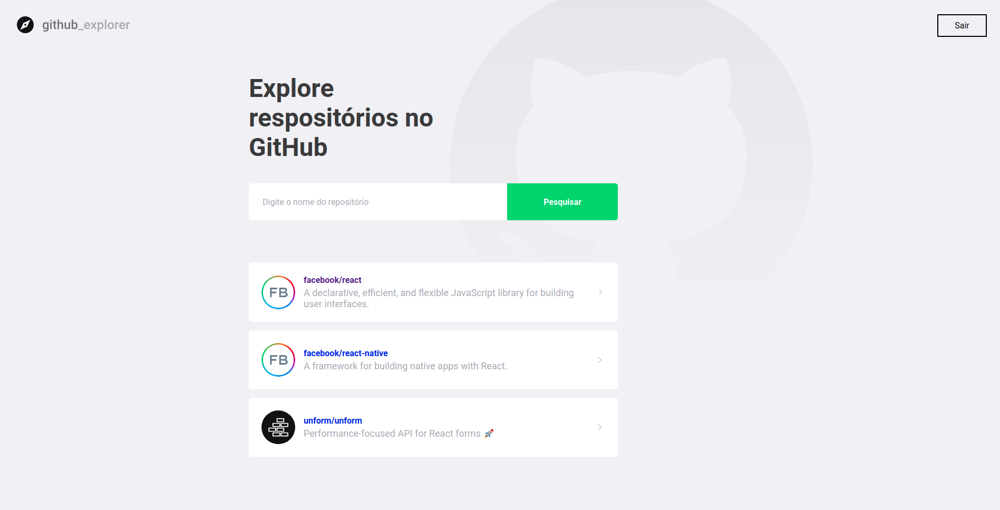

# Table of Content

- [Table of Content](#table-of-content)
  - [1. About The Projet](#1-about-the-project)
  - [2. Folder Structures](#2-folder-structures)
  - [3. Libraries & Frameworks](#3-libraries--frameworks)
  - [4. Installation & Set Up](#4-installation--set-up)

## 1. About The Project
  This project was build with nextJS using the public github api. This is simple add and list github users.
## 2. Folder Structures

```bash
+---pages
|   \---repositories
+---services
\---styles
```

## 3. Libraries & Frameworks

| Name                                                     | Description                                                            |
| -------------------------------------------------------- | ---------------------------------------------------------------------- |
| [NextJS](https://nextjs.org/)                            | The React Framework for Production.                                    |
| [ReactJS](https://reactjs.org/)                          | A JavaScript library for building user interfaces.                     |
| [Axios](https://redux.js.org/)                           | A Predictable State Container for JS Apps.                             |
| [Styled Components](https://styled-components.com/)      | Visual primitives for the component age.                               |

## 4. Installation & Set Up

1. Install project dependencies

```bash
  yarn install or npm install
```

2. Start the development server

```bash
  yarn dev or npm run dev
```
